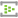
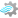

# Azure Architecture Workflow

<table>
  <tr>
    <td align="center"> <strong>Event Hubs</strong> Ingestion bus</td>
    <td align="center">→</td>
    <td align="center"> <strong>ADLS Gen2</strong> Bronze raw landing</td>
    <td align="center">→</td>
    <td align="center"> <strong>Stream Analytics</strong> Near-real-time transform path</td>
    <td align="center">or</td>
    <td align="center"> <strong>Azure Databricks</strong> Advanced streaming path</td>
    <td align="center">→</td>
    <td align="center"> <strong>ADLS Silver/Gold</strong> Curated medallion lake</td>
    <td align="center">→</td>
    <td align="center"> <strong>Snowflake</strong> Serving marts and reconciliation</td>
  </tr>
</table>

## Control Overlay

<table>
  <tr>
    <td align="center"> <strong>Log Analytics</strong> Security and operational telemetry</td>
    <td align="center">→</td>
    <td align="center"> <strong>ADLS Versioning/Soft Delete</strong> Delete recovery and tamper resistance</td>
    <td align="center">→</td>
    <td align="center"> <strong>Event Hubs Retention</strong> Replay window for recovery</td>
  </tr>
</table>
