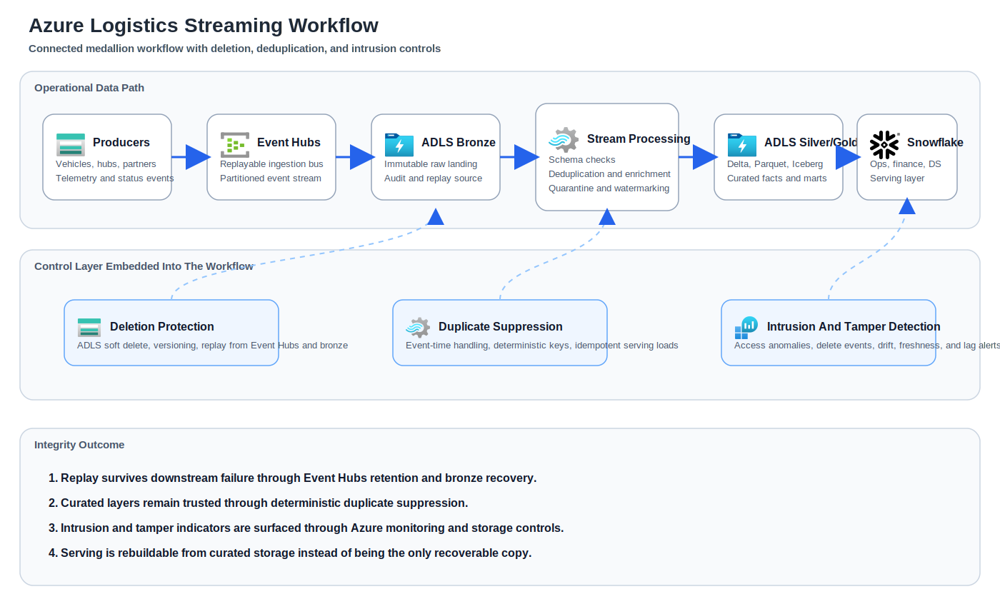

# Azure Architecture Workflow

The diagram keeps the operational path and the integrity-security control path connected so it is clear where deletion recovery, deduplication, and intrusion monitoring act on the data flow.
